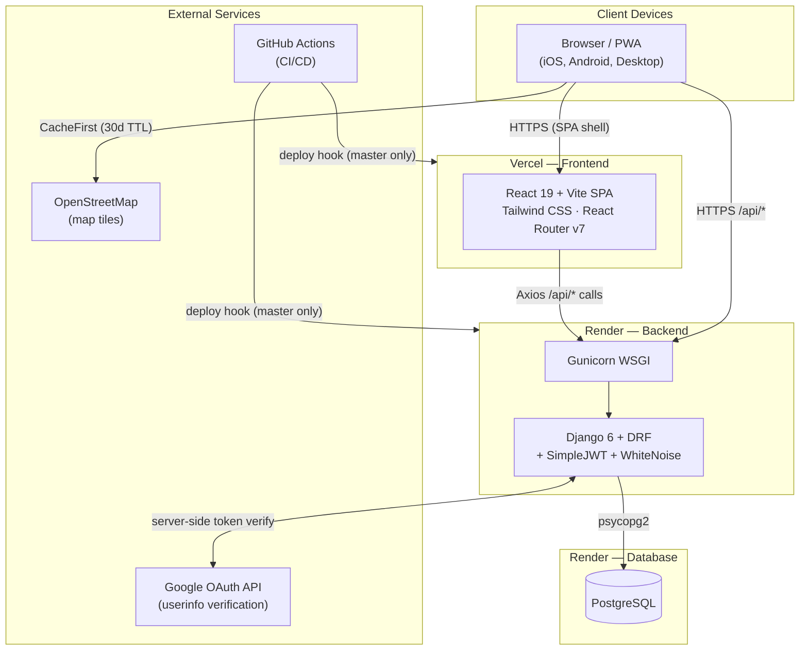
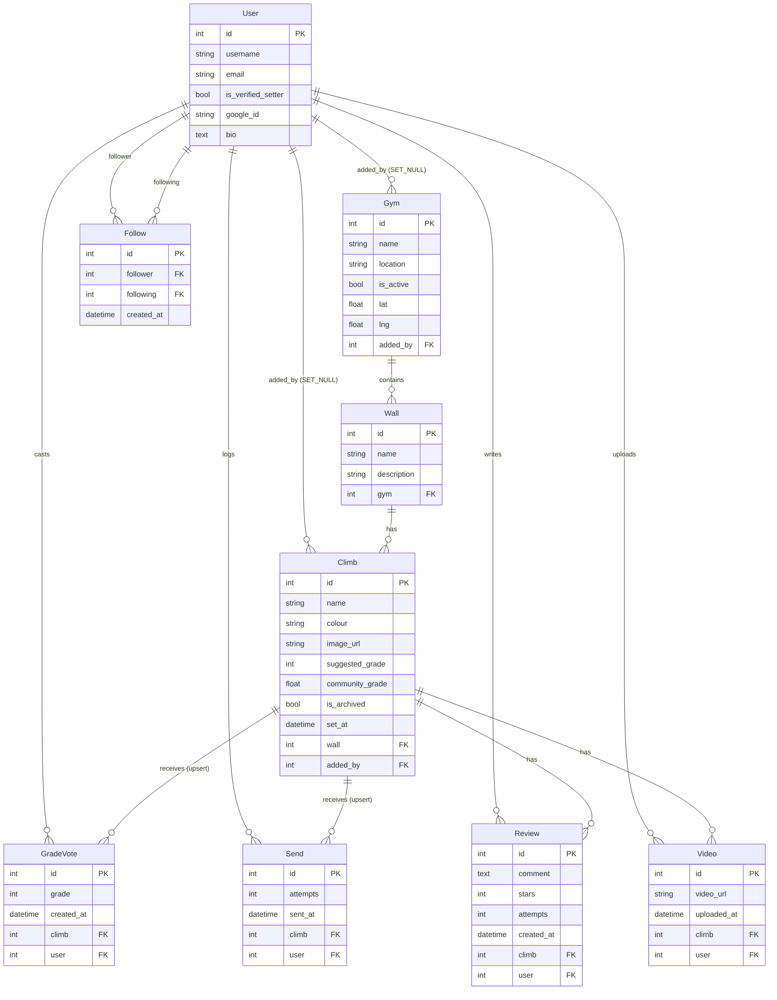
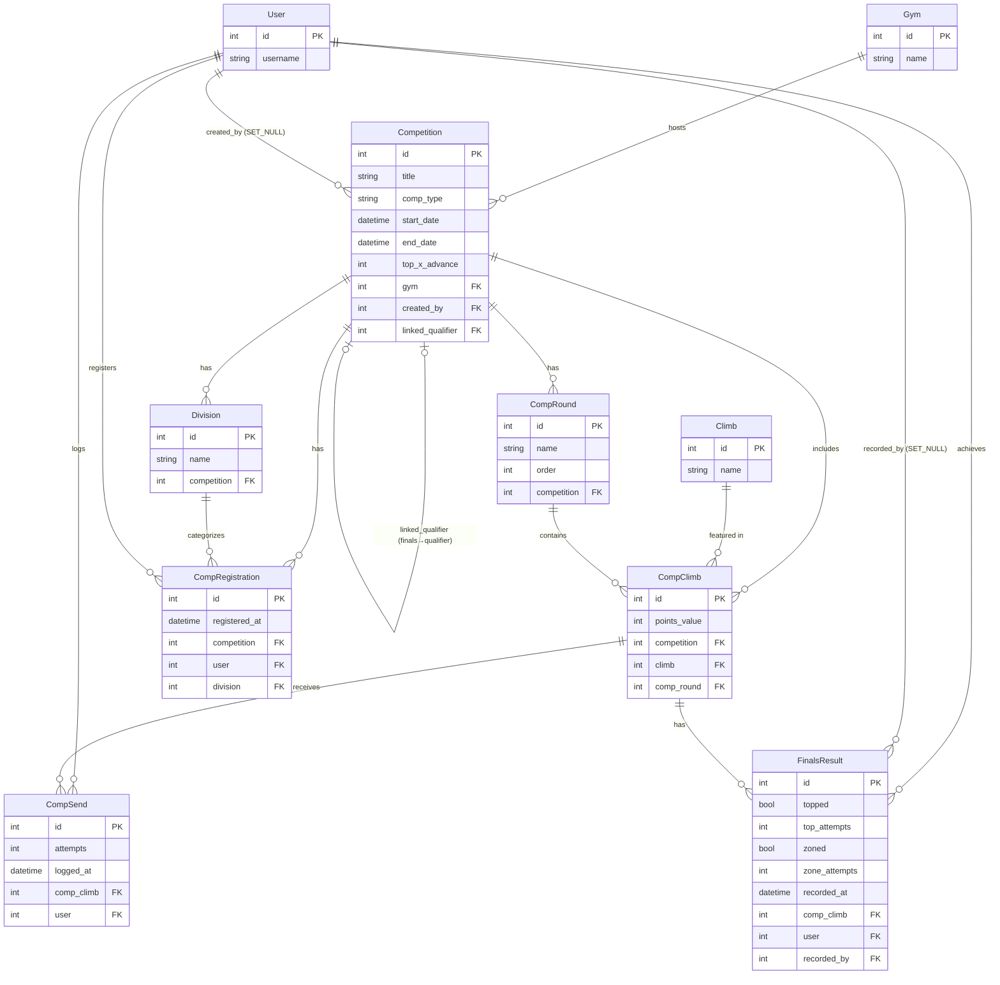
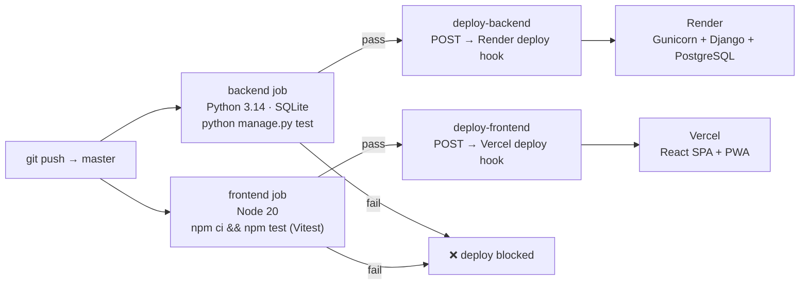

# Architecture & System Design

## 1. Deployment Architecture



---

## 2. Data Model — Core Domain



---

## 3. Data Model — Competition Domain



---

## 4. Authentication Flow

```mermaid
sequenceDiagram
    participant C as React Client
    participant B as Django Backend
    participant G as Google OAuth API

    Note over C,B: Username / Password Login
    C->>B: POST /api/token/  {username, password}
    B-->>C: {access, refresh}  (payload: username, is_setter)
    C->>C: Store in localStorage

    Note over C,B: Authenticated Request
    C->>B: GET /api/*  Authorization: Bearer <access>
    B-->>C: 200 + data

    Note over C,B: Silent Token Refresh
    C->>B: POST /api/token/refresh/  {refresh}
    B-->>C: {access}

    Note over C,B: Logout
    C->>B: POST /api/token/blacklist/  {refresh}
    B-->>C: 200 OK
    C->>C: Clear localStorage, redirect /login

    Note over C,G,B: Google OAuth (climbers only)
    C->>G: Implicit flow via @react-oauth/google
    G-->>C: Google access_token
    C->>B: POST /api/auth/google/  {token}
    B->>G: GET userinfo  (server-side verify)
    G-->>B: {sub, email, name}
    B-->>C: {access, refresh}  (creates user on first login)
    C->>C: Store tokens, redirect /
```

---

## 5. Frontend Route Map

```mermaid
graph TD
    App["App.jsx"]

    App --> PUB["Public Routes"]
    App --> PROT["ProtectedRoute\n(valid JWT required)"]

    PUB --> Login["/login"]
    PUB --> Register["/register"]
    PUB --> NotFound["* → 404"]

    PROT --> Home["/ → Home\nGym list + Leaflet map"]
    PROT --> Gym["/gym/:id → GymPage\nWalls + climbs dashboard"]
    PROT --> Climb["/gym/:gymId/wall/:wallId/climb/:climbId\n→ ClimbPage\nSends · Reviews · Videos · Grade votes"]
    PROT --> AddClimb["/gym/:gymId/wall/:wallId/add-climb\n→ AddClimb  [setter only]"]
    PROT --> Archived["/gym/:gymId/wall/:wallId/archived\n→ ArchivedClimbs"]
    PROT --> Profile["/profile  →  Profile (own)"]
    PROT --> ProfileOther["/profile/:userId  →  Profile (other user)"]
    PROT --> Leaderboard["/gym/:gymId/leaderboard\n→ Leaderboard"]
    PROT --> Feed["/feed → Feed\nActivity from followed users"]
    PROT --> CompList["/gym/:gymId/competitions\n→ CompetitionList"]
    PROT --> CompPage["/gym/:gymId/competitions/:compId\n→ CompetitionPage\nQualifier or Finals view"]
    PROT --> CreateComp["/gym/:gymId/competitions/create\n→ CreateCompetition  [setter only]"]
```



---

## 6. CI/CD Pipeline



---

## 7. API Endpoint Hierarchy

```mermaid
graph TD
    Root["/api/"]

    Root --> Auth["Auth"]
    Root --> Users["Users"]
    Root --> Feed["/feed/"]
    Root --> Gyms["/gyms/"]

    Auth --> Token["/token/  POST — obtain JWT"]
    Auth --> Refresh["/token/refresh/  POST"]
    Auth --> Blacklist["/token/blacklist/  POST"]
    Auth --> Google["/auth/google/  POST — OAuth exchange"]
    Auth --> Register["/user/register/  POST"]

    Users --> UserDetail["/users/:id/  GET·PATCH"]
    Users --> UserSends["/users/:id/sends/"]
    Users --> UserReviews["/users/:id/reviews/"]
    Users --> UserVideos["/users/:id/videos/"]
    Users --> Follow["/users/:id/follow/  POST·DELETE"]
    Users --> PwChange["/users/change-password/  POST"]

    Gyms --> GymList["GET·POST  (setter: POST)"]
    Gyms --> MyGyms["/gyms/my-gyms/"]
    Gyms --> GymDetail["/gyms/:id/  GET·PATCH·DELETE"]
    Gyms --> Walls["/gyms/:id/walls/  GET·POST"]
    Gyms --> GymClimbs["/gyms/:id/all-climbs/"]
    Gyms --> Leaderboard["/gyms/:id/leaderboard/"]
    Gyms --> Comps["/gyms/:id/competitions/  GET·POST"]

    Walls --> WallDetail["/walls/:wallId/  archive-climbs POST"]
    Walls --> Climbs["/walls/:wallId/climbs/  GET·POST"]

    Climbs --> ClimbDetail["/climbs/:id/  GET·PATCH·DELETE"]
    Climbs --> Archived["/climbs/archived/"]
    Climbs --> Votes["/climbs/:id/votes/  GET·POST"]
    Climbs --> Sends["/climbs/:id/sends/  GET·POST"]
    Climbs --> Reviews["/climbs/:id/reviews/  GET·POST"]
    Climbs --> Videos["/climbs/:id/videos/  GET·POST"]

    Comps --> CompDetail["/competitions/:id/  GET·PATCH·DELETE"]
    Comps --> Divisions["/competitions/:id/divisions/  GET·POST"]
    Comps --> Rounds["/competitions/:id/rounds/  GET·POST"]
    Comps --> CompClimbs["/competitions/:id/climbs/  GET·POST"]
    Comps --> Registrations["/competitions/:id/registrations/"]
    Comps --> CompRegister["/competitions/:id/register/  POST"]
    Comps --> CompSends["/competitions/:id/sends/  GET"]
    Comps --> LogSend["/competitions/:id/log-send/  POST"]
    Comps --> QualLB["/competitions/:id/leaderboard/"]
    Comps --> FinalsRes["/competitions/:id/finals-results/  GET·POST"]
    Comps --> FinalsLB["/competitions/:id/finals-leaderboard/"]
```


